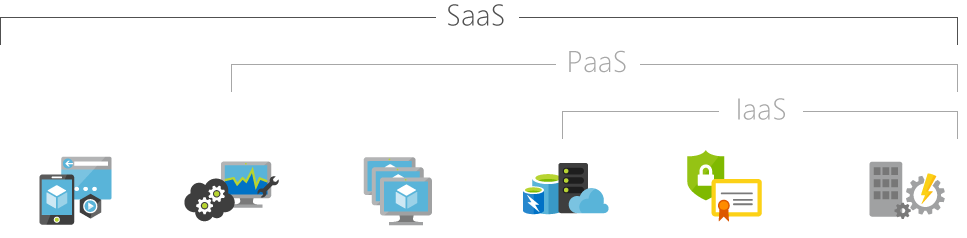

# **Cloud Computing**

---

Todo

- [x] General
- [ ] Amazon
- [ ] Google
- [ ] Microsoft
- [x] Table of contents
- [ ] MLA FORMAT Images and sources

- [**Cloud Computing**](#cloud-computing)
  - [**General**](#general)
  - [**Products**](#products)
    - [**Amazon**](#amazon)
    - [**Google**](#google)
    - [**Microsoft**](#microsoft)
    - [**Other**](#other)
    - [**Example Use**](#example-use)

---

Cloud computing is a relatively new field in computer science, yet everything being learned and done with the internet was ultimately leading down to this. This is essentially because using the cloud is like using the internet. People use the internet nearly every day whether at work or at home saving pictures and documents or even looking at a website and a lot of the time they don't even know that they are using the cloud. However, Cloud computing is an important topic in distributed systems for many reasons. It helps solve a lot of problems in distributed systems in things like scalability, while implementing properties from distributed systems in their own systems. In this chapter we will go through general principles of cloud computing and what can be done with cloud computing. Afterwards, we will discuss popular cloud computing solutions being provided by companies Amazon, Google, and Microsoft. A nice addition is that all three of these comes with free trials so we can learn to use them for free. These cloud services can be public, enterprise, or both. Public clouds are allowed for any number of organizations and individuals, while Enterprise clouds are usually for one organization. For example, Amazon Web Services is currently the biggest public cloud service.[^2] Lastly, there will be other things related to cloud services briefly to be mention at the end.

[^2]: [State of the cloud](https://www.geekwire.com/2018/state-cloud-amazon-web-services-bigger-four-major-competitors-combined/) date visited 4/7/19

## **General**

---

In essence cloud computing is doing exactly what a computer and server does, except the services are across the internet. These services include but are not limited to processing, storage, software, intelligence, databases. All this of course is done for a price, since most things unlike this book are not free. Yet even though it is not free that doesn't mean it is a bad thing since it means we are getting high quality of service. It is also helpful for businesses since they don't always need to have their own servers to do something or can supplement their own servers further with minimal expansion. Instead they can pay a company that runs a cloud service to do whatever they need done.[^1] There are a quite a bit of advantages pertaining to cloud computing.

    -Speed
      - All most immediately services are ready, so whenever we need it it's there
    - Cost
      - Cloud Computing is a lot cheaper for users and companies then buying and setting up servers and storage
      - We don't have to spend money on electricity to power our own personal servers
    - Scale
      - Completely elastic, so as a company grows its servers can grow in the cloud as needed
    - Productivity
      - We save time setting up the servers, changes are updated rapidly
    - Performance
      - Servers are kept up to date constantly that way the user always gets the best possible service
    - Security
      - Servers are protected by their own security meaning users can spend less resources and money on security

These Cloud services achieve these not only by using the latest and best technologies around but by also using common distributed system properties. For example, a lot of what is stored in cloud services is put onto multiple servers for data persistency that way if one server or even a few break, our files will still be available for us and to restore the other servers. Since they use a lot of servers, they can make multiple do a single task like run a program or a website that way it can be used by a lot of users without lagging or crashing. If there aren't enough servers, they can easily expand the cloud networks horizontally by adding more servers or processors. This means they have fault Tolerance and low latency while avoiding a central system. This fault tolerance and low latency that is built into cloud services means that we as the user will also have a low latency assuming our network is good and up to date. It's a lot easier to setup a simple and effective network compared to setting up distributed servers that run and store all our programs and data.

Another Positive that is overlooked is that by making our servers and whatever services we need on the cloud, we are making our systems global in extremely little time. Instead of having to waste time connecting servers over the internet. The cloud does all the heavy lifting so users can connect from where ever and receive whatever they need.

There are three main types of Cloud Computing Infrastructure as a Service (IaaS), Platform as a Service (PaaS), and Software as a Service (SaaS). IaaS is providing the essential infrastructure like storage, security, hosting, and processing, all while being the cheapest of the three.[^6] PaaS is a step above IaaS in that it includes all of IaaS except now we are also given development tools and a system to do it in.[^7] Lastly, SaaS includes the two before it with licensing and hosted centrally.[^8] Common uses of SaaS are office software and email software.

[^1]: [What is cloud computing?](https://azure.microsoft.com/en-us/overview/what-is-cloud-computing/) date visited 4/4
[^6]: [What is SaaS](https://azure.microsoft.com/en-us/overview/what-is-saas/) date visited 4/14
[^7]: [What is PaaS](https://azure.microsoft.com/en-us/overview/what-is-paas/) date visited 4/14
[^8]: [What is IaaS](https://azure.microsoft.com/en-us/overview/what-is-iaas/) date visited 4/14

## **Products**

---

When it comes to cloud computing there are a lot of services that are shared among competitors. Services like processing, storage, hosting apps, databases management, and even AI. Yet no services are the same. Amazon Web Services has some cloud solutions that Microsoft Azure or Google Cloud doesn't have, and the same can go the other way. Since, all the services are trying to differentiate so they get more users and companies. So, it is important to know what services are needed for what we are trying to use the cloud so we can purchase the right services for the right problem.

### **Amazon**

---

Amazon is currently the biggest cloud service available in the market and still has a continuous growth.[^2] Offering a huge range of services with a pay per use service model has helped to build this service to become the largest. So, whether we are aiming to host something for peers or for work Amazon has what we need to build it. Even robotics, which is a solution only Amazon has.

[^3]: [Amazon Web Services](https://aws.amazon.com/?nc2=h_lg) date visited 4/9

### **Google**

---

(note) An upside to Google cloud is the other products available from Google like Google maps, which Google cloud users can use in their apps and products.

[^5]: [Google Cloud Services](https://cloud.google.com/products/#featured-products)

### **Microsoft**

---

(note) As a fourth type of Cloud Service Microsoft gives serverless computing.

[^4]: [Azure Services](https://azure.microsoft.com/en-us/solutions/) date visited 4/13

### **Other**

---

  A recently new idea came about recently in cloud computing, one that is made for more personal and home use. The idea is using the cloud to play a game and stream it to a person's home. People would be able to enjoy their games wherever they want at the touch of a button and an internet connection. Another positive is that it will be a lot cheaper than buying a gaming computer, which is out of most people's price range. Companies like Google have been producing this technology for quite a while now. And with latest graphics cards being stronger than ever, one part of their problem is solved. There is however, one huge problem, bandwidth. Since, services like Google Stadia and others want to stream games at 4k Resolution, it takes a huge amount of bandwidth to keep a constant FPS and image quality. And while internet speeds have been going up, we have not reached a point where people have near gigabit speeds constantly. So even if a person can hit these speeds it is hard to keep them going constantly, especially in the day when other people are using the internet just as much as the person attempting to play games. This is still a very important part of cloud computing because it is pushing it further into what other things, we can accomplish with cloud computing.

  

### **Example Use**

---